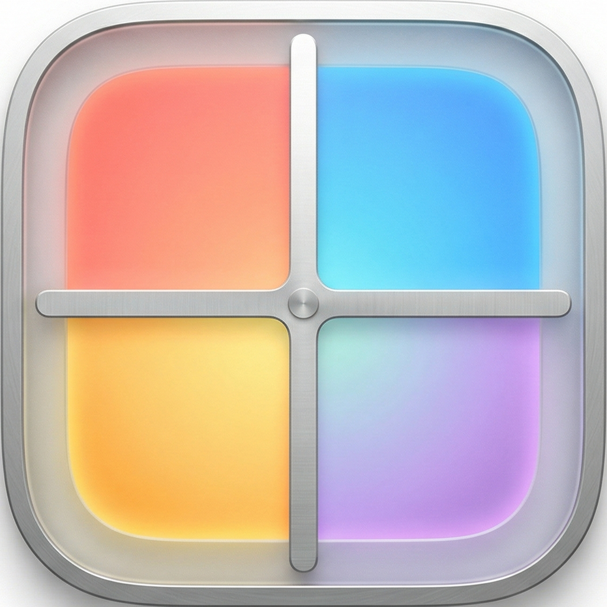

<p align="center">
  
</p>

<h1 align="center">WindowGrid</h1>

<p align="center">Open-source window management for macOS. Hold a configurable modifier key and drag any window to snap it into a grid zone.</p>

<p align="center">
  English | <a href="README_CN.md">中文</a>
</p>

<p align="center">
  
  
  
</p>

## Features

- **Drag to snap** — Hold your chosen modifier key + drag a window, release to snap it into a grid zone
- **Configurable drag modifier** — Choose Control, Command, Shift, or Option from the menu bar
- **Per-desktop layouts** — Set different layouts per display and per macOS desktop/Space
- **Temporary desktop locks** — Lock a desktop workspace from the toast for 30 minutes, 60 minutes, or 2 hours
- **Grid overlay** — Semi-transparent grid appears while dragging, highlights the target zone
- **9 preset layouts** — 6-Grid, 4-Grid, 9-Grid, 3-Column, 2-Column, 1+4 (Tall Left), 4+1 (Tall Right), Wide Top, Wide Bottom
- **Custom layout editor** — Adjust grid size and merge cells to create your own layouts
- **Arrange All Windows** — One click to auto-fill all windows into the grid
- **Adaptive arrange** — Optional mode that chooses a temporary grid from the current desktop's window count; one window uses half the screen
- **Window swap** — Drag a window onto an occupied zone to swap their positions
- **Scene memory** — Save and restore named window arrangements, including browser tab URLs
- **Menu bar app** — Switch layouts from the menu bar, no dock icon clutter
- **Launch at login** — Start automatically when you log in
- **Ultrawide optimized** — Designed for 21:9 and 32:9 ultrawide monitors
- **Zero dependencies** — Pure Swift + AppKit, no third-party libraries
- **Lightweight** — Minimal CPU and memory usage

## Install

### Download

Download the latest signed `.dmg` from [Releases](https://github.com/Liko0223/WindowGrid/releases), open it, and drag `WindowGrid.app` to `/Applications`.

You'll be prompted to grant Accessibility permission on first launch.

### Build from source

```bash
git clone https://github.com/Liko0223/WindowGrid.git
cd WindowGrid
make install
```

This builds a release binary, packages it as `WindowGrid.app`, and copies it to `/Applications`.

## Usage

1. Launch WindowGrid — it appears as a grid icon in the menu bar
2. **Hold the configured modifier key** and **drag any window** by its title bar
3. A grid overlay appears on screen
4. Move to the desired zone (it highlights blue)
5. **Release the mouse** — the window snaps into place

### Switch layouts

Click the menu bar icon to switch between preset layouts, or open **Edit Layouts** to create custom ones by merging cells.

Layout choices are saved for the current physical display and current macOS desktop/Space. Switch to Desktop 1, choose a layout from the **WG** menu; switch to Desktop 2, choose another layout; WindowGrid will remember them separately. Use **Set "..." as Default** for the fallback layout, or **Use Default Layout on This Desktop** to clear the current desktop override.

### Change the drag modifier

Open **Drag Modifier** from the menu bar and choose Control, Command, Shift, or Option. Control is the default because Option can conflict with macOS window/app hiding behavior.

### Arrange All Windows

Click **Arrange All Windows** from the menu bar to auto-fill all visible windows into the current grid. Extra windows are minimized.

Use **Arrange Shortcut** in the **WG** menu to change or disable the global arrange hotkey.

Turn on **Adaptive Arrange by Window Count** when you want Arrange to generate a temporary grid from the number of windows on the current desktop. It is off by default; with one window, Arrange places it in half the screen instead of full screen. Repeated Arrange clicks first rotate which window goes into the primary zone, then cycle through alternate layouts for the same window count.

When switching macOS desktops, WindowGrid shows a small draggable toast with the current desktop name and layout. Drag it to move the toast; the position is saved.

### Scenes

Save your current window arrangement as a named scene (e.g., "Coding", "Design"). Restore it anytime — windows snap back to their saved positions, and browser tabs are reopened.

- **Save:** Menu → Scenes → Save Current Scene
- **Restore:** Menu → Scenes → click a scene name
- **Update:** Hover on a scene → Update
- **Delete:** Hover on a scene → Delete

## Requirements

- macOS 13 (Ventura) or later
- **Accessibility permission** — required for moving and resizing windows
- **Automation permission** (optional) — enables browser tab URL saving in scenes

## Configuration

Config file is at `~/.config/windowgrid/config.json`. Custom layouts, saved scenes, drag modifier, and per-display/per-desktop layout assignments are stored here.

## Building

```bash
make build      # Debug build
make release    # Release build
make app        # Package as .app
make install    # Install to /Applications
make dev-dmg    # Create a local/dev signed dist/WindowGrid-macOS.dmg
make dmg        # Create a Developer ID signed dist/WindowGrid-macOS.dmg
make release-check NOTARY_PROFILE=windowgrid-notary  # Check Developer ID and notarization prerequisites
make release-dmg NOTARY_PROFILE=windowgrid-notary  # Sign, notarize, staple, and verify the DMG
make run        # Build and run (debug)
make clean      # Clean build artifacts
```

WindowGrid uses Sparkle 2 for in-app updates. Release builds should use monotonically increasing bundle versions:

```bash
make release-dmg NOTARY_PROFILE=windowgrid-notary MARKETING_VERSION=0.1.1 CURRENT_PROJECT_VERSION=2
```

This builds with Xcode, signs Sparkle's helper tools correctly, produces the notarized DMG, and writes `site/appcast.xml`. See `docs/sparkle-updates.md`.

For public downloads outside the Mac App Store, install a **Developer ID Application** certificate and create a notarytool keychain profile before publishing:

```bash
xcrun notarytool store-credentials windowgrid-notary \
  --apple-id you@example.com \
  --team-id TEAMID \
  --password app-specific-password

make release-dmg NOTARY_PROFILE=windowgrid-notary
```

`make dmg` intentionally fails when no Developer ID Application certificate is installed, so release builds do not silently fall back to Apple Development or ad-hoc signatures.

## License

MIT
