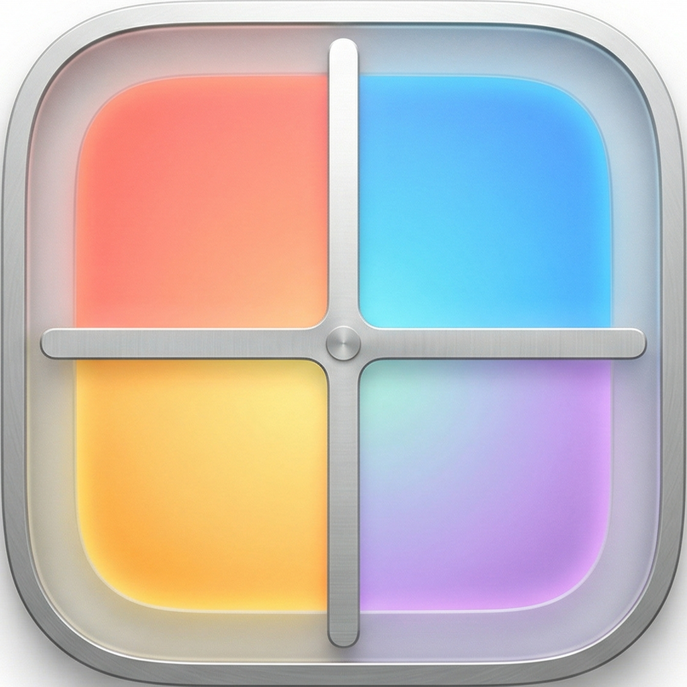

<p align="center">
  
</p>

<h1 align="center">WindowGrid</h1>

<p align="center">开源 macOS 窗口管理工具。按住 <b>Option</b> 拖拽任意窗口，松手即吸附到网格中。</p>

<p align="center">
  <a href="README.md">English</a> | 中文
</p>

<p align="center">
  
  
  
</p>

## 功能特性

- **拖拽吸附** — 按住 Option + 拖拽窗口，松手自动吸附到对应网格区域
- **网格覆盖层** — 拖拽时自动显示半透明网格，高亮目标区域
- **9 种预设布局** — 6 格、4 格、9 格、3 列、2 列、1+4（左长条）、4+1（右长条）、上宽下窄、上窄下宽
- **自定义布局编辑器** — 调整网格行列数，点击合并格子，创建你自己的布局
- **一键排列** — 一键将所有窗口自动填入网格，多余窗口自动最小化
- **窗口互换** — 拖拽窗口到已有窗口的格子上，两个窗口自动交换位置
- **场景记忆** — 保存和恢复窗口排列方案，支持记住浏览器标签页 URL
- **菜单栏常驻** — 从菜单栏快速切换布局，不占用 Dock 栏
- **开机自启** — 登录后自动启动
- **超宽屏优化** — 专为 21:9 和 32:9 超宽屏设计
- **零依赖** — 纯 Swift + AppKit，无第三方库
- **轻量级** — 极低的 CPU 和内存占用

## 安装

### 直接下载

从 [Releases](https://github.com/Liko0223/WindowGrid/releases) 下载最新的 `.zip` 文件，解压后将 `WindowGrid.app` 拖入 `/Applications` 文件夹。

> **首次启动：** 右键点击 app → 打开（未签名应用需要此操作）。启动后会提示授权辅助功能权限。

### 从源码构建

```bash
git clone https://github.com/Liko0223/WindowGrid.git
cd WindowGrid
make install
```

自动编译、打包为 `.app` 并安装到 `/Applications`。

## 使用方法

1. 启动 WindowGrid — 菜单栏右上角出现网格图标
2. **按住 Option** 键，**拖拽任意窗口**的标题栏
3. 屏幕上出现半透明网格覆盖层
4. 移动到目标格子（蓝色高亮）
5. **松开鼠标** — 窗口自动吸附到位

### 切换布局

点击菜单栏图标，选择预设布局，或打开 **Edit Layouts** 自定义布局（合并格子）。

### 一键排列

点击菜单栏中的 **Arrange All Windows**，所有可见窗口自动按顺序填入当前网格。超出格子数量的窗口会被最小化。

### 场景管理

将当前窗口排列保存为命名场景（如"写代码"、"设计"），随时一键恢复。

- **保存：** 菜单 → Scenes → Save Current Scene
- **恢复：** 菜单 → Scenes → 点击场景名称
- **更新：** 悬停场景名 → Update
- **删除：** 悬停场景名 → Delete

恢复场景时，浏览器会自动打开之前保存的标签页 URL。

## 系统要求

- macOS 13（Ventura）或更高版本
- **辅助功能权限** — 用于移动和调整窗口大小
- **自动化权限**（可选） — 用于保存浏览器标签页 URL

## 配置

配置文件位于 `~/.config/windowgrid/config.json`，自定义布局和场景数据存储在此。

## 构建命令

```bash
make build      # 调试构建
make release    # 发布构建
make app        # 打包为 .app
make install    # 安装到 /Applications
make run        # 构建并运行（调试模式）
make clean      # 清理构建产物
```

## 开源协议

MIT
